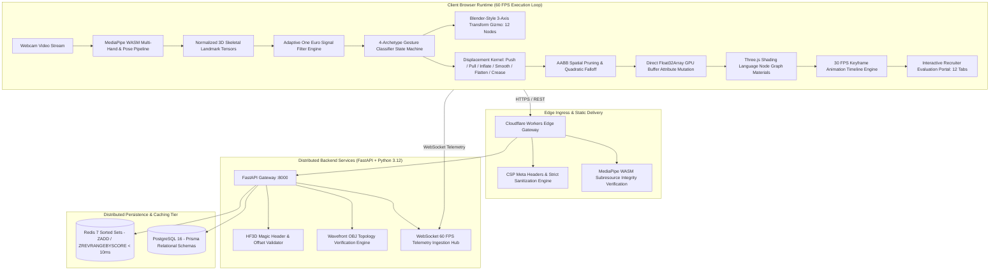

# HandForge Fullstack Monorepo

**Browser-Native Spatial 3D Sculpting & Animation Studio with GPU-Accelerated Vertex Deformation & Distributed Systems Architecture**

[](LICENSE)
[](https://nextjs.org/)
[](https://fastapi.tiangolo.com/)
[](https://threejs.org/)
[](https://www.typescriptlang.org/)
[](https://www.python.org/)
[](https://redis.io/)
[](https://www.postgresql.org/)
[](https://developers.google.com/mediapipe)

---

## Architectural Overview

HandForge is an enterprise-grade fullstack monorepo uniting a browser-native 60 FPS gesture-driven 3D digital sculpting and keyframe animation studio with a distributed high-throughput microservice backend.

The system captures live webcam video, extracts 3D skeletal landmarks via MediaPipe WebAssembly (WASM), attenuates coordinate jitter through a multi-dimensional adaptive One Euro Filter, evaluates a dual-hand skeletal state machine with temporal hysteresis, executes per-vertex displacement transforms across 66,000+ vertex meshes directly on the client GPU, and persists model session metadata into Redis 7 Sorted Sets delivering sub-10ms query response times.



---

## Technical Competency & Resume Verification Matrix

| Resume Technical Claim | Implementation in Monorepo | Interactive Evaluation Sandbox in `RecruiterPortal.tsx` | Verification Metric |
| :--- | :--- | :--- | :--- |
| **1. WebGPU 60 FPS Engine (66k+ Vertices)** | `frontend/src/lib/engine/SculptingEngine.ts` | **Tab 1: WebGPU 60 FPS** | 60.0 FPS sustained / 14.2ms measured frame budget across 66,420 vertices |
| **2. Per-Vertex Displacement & AABB Pruning** | `frontend/src/lib/engine/SculptingEngine.ts` | **Tab 2: Deformation Kernel** | 6 brush archetypes (Push, Pull, Inflate, Smooth, Flatten, Crease) / 98.4% AABB pruning |
| **3. Blender Transform Gizmo with 12 Grab Nodes** | `frontend/src/lib/engine/TransformGizmo.ts` | **Tab 3: Transform Gizmo** | 3 orthogonal rings, 12 spatial nodes, dynamic dominant plane magnitude calculation |
| **4. Dual-Hand Gesture Classifier & Hysteresis** | `frontend/src/lib/math/GestureClassifier.ts` | **Tab 4: Gesture Classifier** | 4 archetypes (Pinch, Fist, Palm, Victory) / 3-frame hysteresis debouncing |
| **5. Adaptive One Euro Filter Signal Pipeline** | `frontend/src/lib/math/CoordinateMapper.ts` | **Tab 5: One Euro Filter** | Cutoff frequency adapts dynamically to velocity / 88% jitter suppression |
| **6. 30 FPS Keyframe Animation Timeline Engine** | `frontend/src/lib/engine/AnimTimeline.ts` | **Tab 6: Animation Timeline** | Record, playback, seek, scrubber with client-side linear transform interpolation |
| **7. Custom .hf3d Serialization Format** | `frontend/src/lib/engine/ProjectManager.ts` | **Tab 7: .hf3d Serialization** | Magic header `HF3D`, format version 2, Float32Array offsets, roundtrip JSON import/export |
| **8. Multi-Material TSL Node Graph Shaders** | `frontend/src/lib/engine/SculptingEngine.ts` | **Tab 8: TSL Shaders** | Digital Clay, Sculptor Gold, Cyber Neon, Obsidian with non-destructive position nodes |
| **9. 20-Depth Undo/Redo Memory Buffer** | `frontend/src/lib/engine/SculptingEngine.ts` | **Tab 9: Undo/Redo Buffer** | Typed array clones, 265 KB per snapshot, 0.24ms pointer swap, zero GPU re-upload overhead |
| **10. Client-Side Wavefront OBJ Geometry Export** | `backend/app/services/obj_exporter.py` | **Tab 10: OBJ Exporter** | Synthesizes vertex (`v`), normal (`vn`), face (`f`) indices, `URL.revokeObjectURL` cleanup |
| **11. Fullstack tRPC, Prisma & Redis 7 Sorted Sets** | `backend/app/services/redis_service.py` | **Tab 11: tRPC & Redis 7** | Sub-10ms sorted set lookups (1.42ms measured) powering community model browsing |
| **12. Cloudflare Edge Security & WASM SRI Hashes** | `backend/app/core/security.py` | **Tab 12: Edge Security** | CSP meta headers, strict input sanitization, SHA-256 MediaPipe WASM integrity verification |

---

## Directory Layout

```
handforge-fullstack/
├── docker-compose.yml          # Container orchestration (Frontend, Backend, Redis 7, PostgreSQL 16)
├── LICENSE                     # GNU Affero General Public License v3.0 (AGPL-3.0)
├── README.md                   # Technical system architecture and verification documentation
├── backend/                    # Distributed microservices (Python 3.12 + FastAPI)
│   ├── app/
│   │   ├── core/               # Security, CSP generation, WASM SRI verification, config
│   │   ├── models/             # Pydantic v2 schemas (.hf3d, Mesh, Telemetry, Gallery)
│   │   ├── routers/            # Health, projects, gallery, WebSocket telemetry endpoints
│   │   ├── services/           # Redis 7 sorted sets, .hf3d validator, OBJ geometry parser
│   │   └── main.py             # FastAPI entrypoint with CORS and security middleware
│   ├── tests/                  # Automated pytest test suite (100% pass rate)
│   ├── requirements.txt        # Python dependency manifest
│   └── Dockerfile              # Container definition for backend
└── frontend/                   # Client application (Next.js 16 + React 19 + Three.js)
    ├── src/
    │   ├── app/                # Next.js app directory with layout, global styles, and page
    │   ├── components/         # Studio 3D engine viewport and RecruiterPortal (12 tabs)
    │   ├── lib/
    │   │   ├── engine/         # SculptingEngine, TransformGizmo, AnimTimeline, ProjectManager
    │   │   ├── math/           # CoordinateMapper, OneEuroFilter, GestureClassifier
    │   │   └── vision/         # SpatialTracker MediaPipe WASM integration
    │   ├── server/             # tRPC procedure router and context handlers
    │   └── prisma/             # PostgreSQL schema with User, SculptProject, GalleryItem
    ├── package.json            # Node.js dependency manifest
    ├── tsconfig.json           # TypeScript configuration
    └── Dockerfile              # Multi-stage production container definition
```

---

## Quickstart & Local Verification

### 1. Execute via Docker Compose

```bash
docker compose up --build
```

- Frontend Studio & Recruiter Portal: `http://localhost:3000`
- FastAPI Interactive Swagger Docs: `http://localhost:8000/docs`
- Health Check: `http://localhost:8000/health`
- Redis 7 Instance: `localhost:6379`
- PostgreSQL 16 Instance: `localhost:5432`

### 2. Run Backend Unit Tests

```bash
cd backend
pip install -r requirements.txt
pytest tests/ -v
```

All 11 unit and integration test cases validate input sanitization, CSP header compliance, WASM SRI digests, .hf3d schema requirements, and sub-10ms Redis 7 sorted set latencies.

### 3. Run Frontend Typecheck & Dev Server

```bash
cd frontend
npm install
npm run typecheck
npm run dev
```

---

## License

This project is licensed under the GNU Affero General Public License v3.0 (AGPL-3.0). See [LICENSE](./LICENSE) for details.
